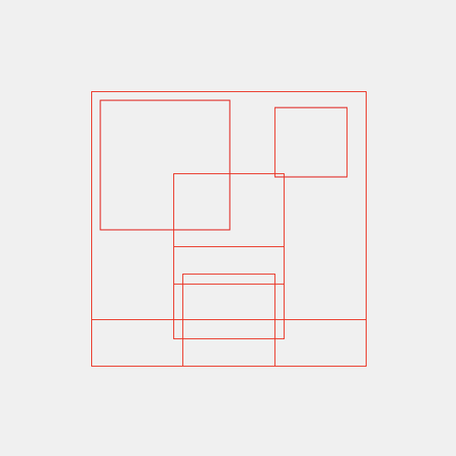

# hukuwarai-inference

(Not Production Ready)

## setup

Write `.env` file.

```bash
AWS_ACCESS_KEY_ID=
AWS_SECRET_ACCESS_KEY=
AWS_DEFAULT_REGION=
BUCKET=
```


```bash
$ docker build -t hukuwarai-inference .
```


## Usage

```bash
$ docker run -p 8000:8000 hukuwarai-inference
```

- `http://localhost:8000/`
- `http://localhost:8000/docs`: Swagger 

## Endpoints


### `POST /similarity`

Calculate similarity between two images.

#### Request

```json
{
  "img1": {
    "data": "string"
  },
  "img2": {
    "data": "string"
  },
  "model_name": "string"
}
```

- `img1`: Image data. base64 encoded any image.
- `img2`: Image data. base64 encoded any image.
- `model_name`: Model name. Models in https://github.com/huggingface/pytorch-image-models, `"mse"`, `"zero"` are available. `"mse"` is Mean Squared Error, `"zero"` is always return 0.0. (for testing). 

> [!NOTE]
> **`timm/convit_tiny.fb_in1k` is recommended !!**

#### Response

Similarity between two images.

It is guaranteed that the similarity is between -1.0 and 1.0.


```json
{
  "similarity": 0.0
}
```


### `POST /render`

Render image from HTML and CSS.

#### Request

```json
{
  "html_src": "string",
  "css_src": "string"
}
```

- `html_src`: HTML source.
- `css_src`: CSS source.


#### Response


```json
{
  "image_path": "string"
}
```

- `image_path`: Path to rendered image.


### `POST /palette`

Get color palette from image.

#### Request

```json
{
  "img": {
    "data": "string"
  },
  "max_colors": 0
}
```

- `img`: Image data. base64 encoded any image.
- `max_colors`: Maximum number of colors. 

#### Response

```json
{
  "palette": [
    "string"
  ],
  "n_colors": 0
}
```

- `palette`: List of colors in hex.
- `n_colors`: Number of colors.

It is guaranteed that the number of colors is less than or equal to `max_colors`.

### `POST /boudingbox`

Render bounding boxed of input HTML and CSS.

#### Request

```json
{
  "html_src": "string",
  "css_src": "string"
}
```

- `html_src`: HTML source.
- `css_src`: CSS source.

#### Response

```json
{
  "image_path": "string"
}
```

- `image_path`: Path to rendered image.


## Chcker

```bash
➤ python3 check.py similarity assets/render.png assets/render2.png timm/convit_tiny.fb_in1k
Result: {'similarity': 0.549897313117981}
Elapsed time: 0.96 seconds

Total elapsed time: 1.10 seconds

➤ python3 check.py render assets/example.html assets/example.css
Result: {'image_path': 'rendered_5ae90cd1-9a4d-40d5-b6b2-c1024d06b087.png'}
Elapsed time: 0.22 seconds

Total elapsed time: 0.36 seconds

➤ python3 check.py palette assets/abap34.jpeg 10
Result: Saved palette image to palette_52c15f2a-e3f4-4f3e-a731-87e66743e43c.png
Elapsed time: 2.44 seconds

Total elapsed time: 2.58 seconds

➤ python3 check.py boundingbox assets/example.html assets/example.css
Result: {'image_path': 'rendered_5973a45c-75ac-4900-804a-fb5007378cf8.png'}
Elapsed time: 0.31 seconds

Total elapsed time: 0.45 seconds
```


`rendered_5ae90cd1-9a4d-40d5-b6b2-c1024d06b087.png` is


Palette of @abap34's icon with `max_colors=10` is 


Palette of Figma's logo with `max_colors=10` is


(It's generation is terminated by threshold of score)


`rendered_5973a45c-75ac-4900-804a-fb5007378cf8.png` (Bounding Box of `assets/example.html` and `assets/example.css`) is




