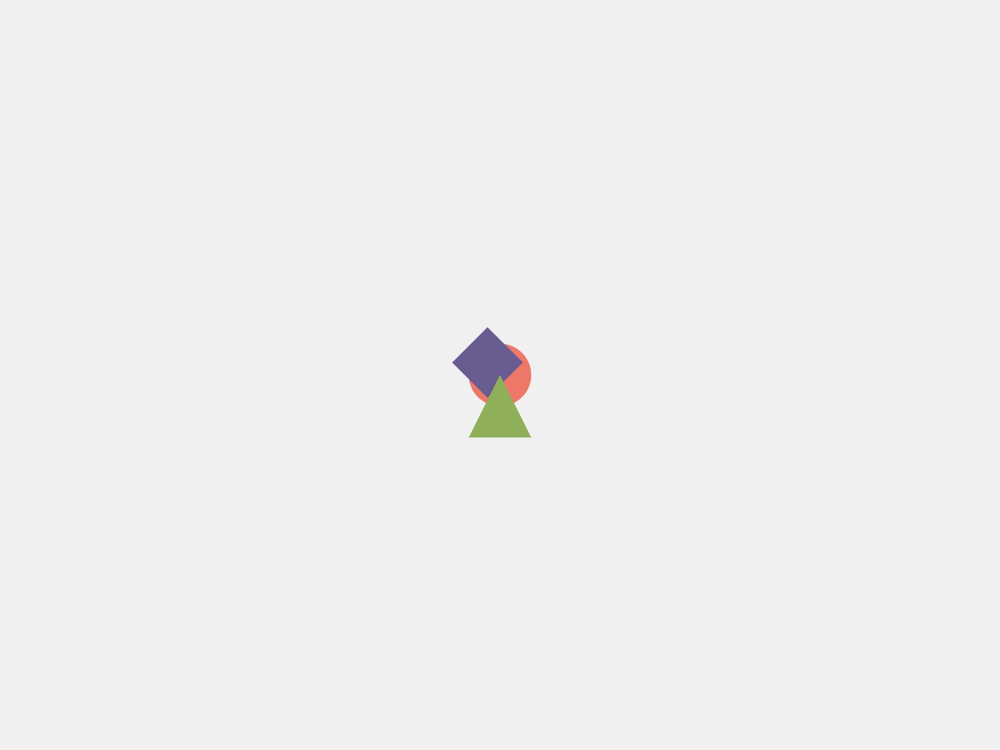

# hukuwarai-inference

(Not Production Ready)

## Usage

```bash
$ pipenv install
$ pipenv run python main.py
```

- `http://localhost:8000/`
- `http://localhost:8000/docs`: Swagger 

## Endpoints


### `POST /similarity`

Calculate similarity between two images.

#### Request

```json
{
  "img1": {
    "data": "string"
  },
  "img2": {
    "data": "string"
  },
  "model_name": "string"
}
```

- `img1`: Image data. base64 encoded any image.
- `img2`: Image data. base64 encoded any image.
- `model_name`: Model name. Models in https://github.com/huggingface/pytorch-image-models, `"mse"`, `"zero"` are available. `"mse"` is Mean Squared Error, `"zero"` is always return 0.0. (for testing). 

:::note
timm/convit_tiny.fb_in1k is recommended !!
:::

#### Response

Similarity between two images.

It is guaranteed that the similarity is between 0.0 and 1.0.


```json
{
  "similarity": 0.0
}
```


### `POST /render`

Render image from HTML and CSS.

#### Request

```json
{
  "html_src": "string",
  "css_src": "string"
}
```

- `html_src`: HTML source.
- `css_src`: CSS source.


#### Response


```json
{
  "image_path": "string"
}
```

- `image_path`: Path to rendered image.


### `POST /palette`

Get color palette from image.

#### Request

```json
{
  "img": {
    "data": "string"
  },
  "max_colors": 0
}
```

- `img`: Image data. base64 encoded any image.
- `max_colors`: Maximum number of colors. 

#### Response

```json
{
  "palette": [
    "string"
  ],
  "n_colors": 0
}
```

- `palette`: List of colors in hex.
- `n_colors`: Number of colors.

It is guaranteed that the number of colors is less than or equal to `max_colors`.

## Chcker

```bash
➤ python3 check.py similarity target.png dog.jpg resnet18
result: {'similarity': 0.3008711338043213}
➤ python3 check.py render assets/example.html assets/example.css
result: {'image_path': 'rendered_73b2a327-f2f9-4acc-ad59-7b7d2b02fbfc.png'}
➤ python3 check.py assets/palette dog.jpg 10
result: {'palette': ['#342921', '#f2edc9', '#99c761', '#dfad79', '#b18255', '#afa59d', '#fcfcf1', '#756e4b', '#bada7b', '#e5e59e'], 'n_colors': 10}
```


`rendered_73b2a327-f2f9-4acc-ad59-7b7d2b02fbfc.png` is




Palette of @abap34's icon with `max_colors=10` is 


Palette of Figma's logo with `max_colors=10` is


(It's generation is terminated by threshold of score)

